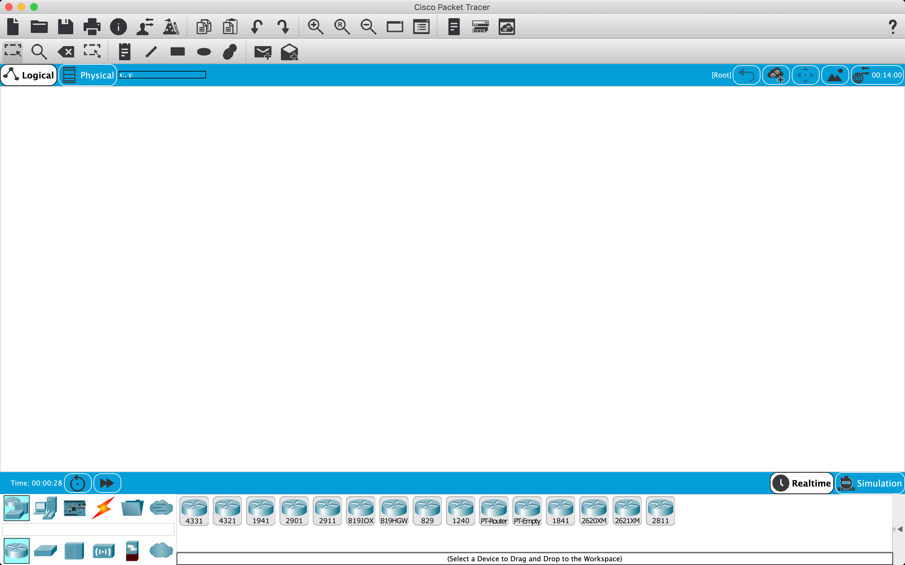

# Cisco Packet Tracer
*Yes, it's FREE!*

Packet tracer allows you to build and simulate networks to practice and test your understanding. You can select routers, switches, devices, configure them, etc.

## Get packet tracer

Google `cisco packet tracer`, enroll for free then download the software. When you open it up you should be this.



## Example Usage A: Setup and configure a home network

Cisco command line

```bash
show ip interface brief

configure terminal

fastEthernet 0/0

ip address X Y

shutdown
no shutdown

# Write our changes
wr
```

TODO - complete this page