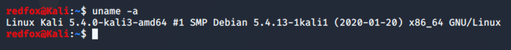

# Hacker Handbook

This site contains notes and guides pertaining to hacking as well as scripts for educational purposes only.

For quick guides reference my [cheatsheets repo](https://github.com/nancynobody/cheatsheets)

## Systems

I will try and say what system I am using if its relevant however in general I will be using Kali, Ubuntu or OSX.

**Kali Linux**

Ubuntu