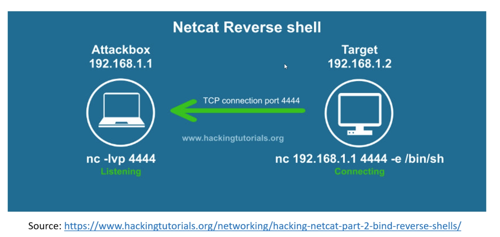

# Exploitation

# Vuln Research Tools

exploit-db.com
cvedetails.com
rapid7

`searchsploit Samba 2`

## Reverse Shell vs Bind Shell

**Reverse shell -> target connects to us**

**Bind shell -> we connect to target**

## Staged vs Non-staged Payloads

* Non-staged -> sends payload all at once (designated with `_` in `msfconsole`)

* Staged -> sends payload in stages (designated with `/` in `msfconsole`)

TODO FINISH THIS PAGE

## Brute Forcing

Hydra

`hydra -l root -P /user/share/wordlists/metasploit/unix_passwords.txt ...`

## Credential Stuffing

injecting breached account credentials in hopes of account takeover

## Password Spraying
