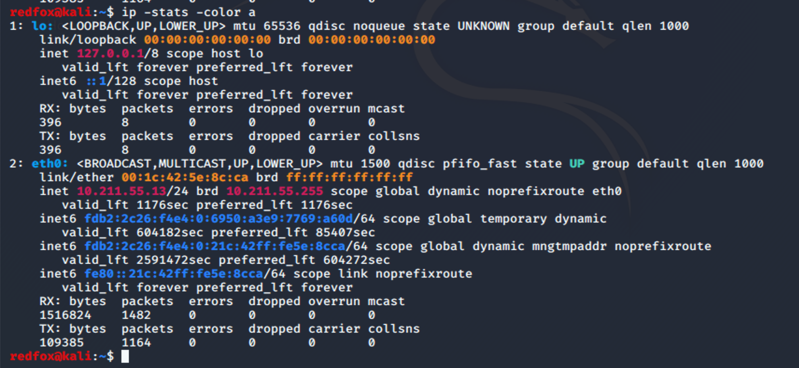
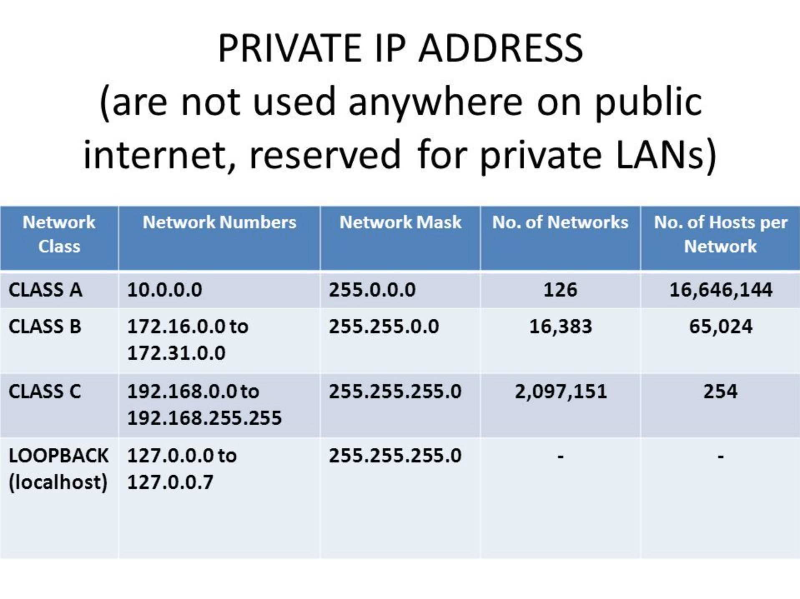
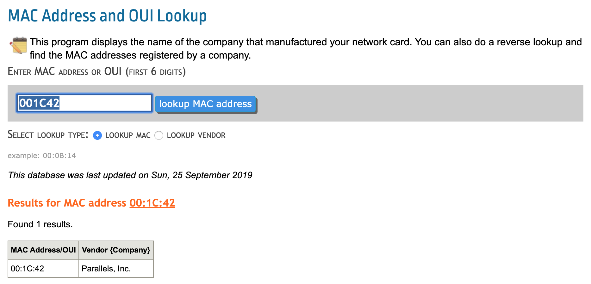
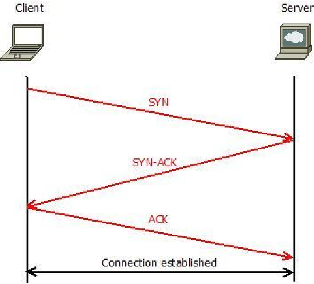
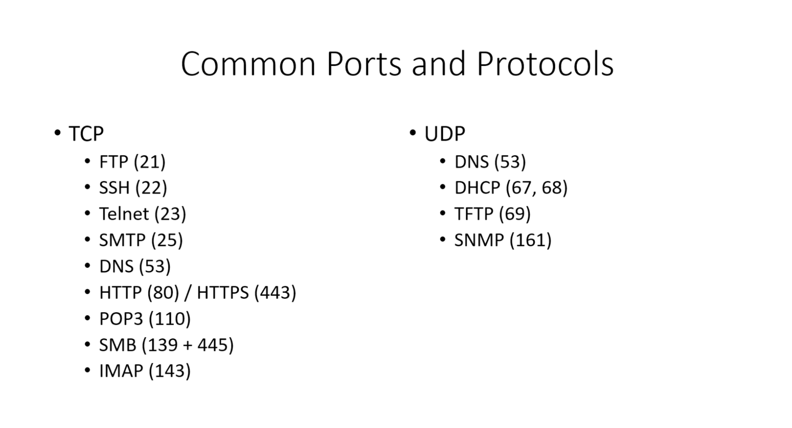
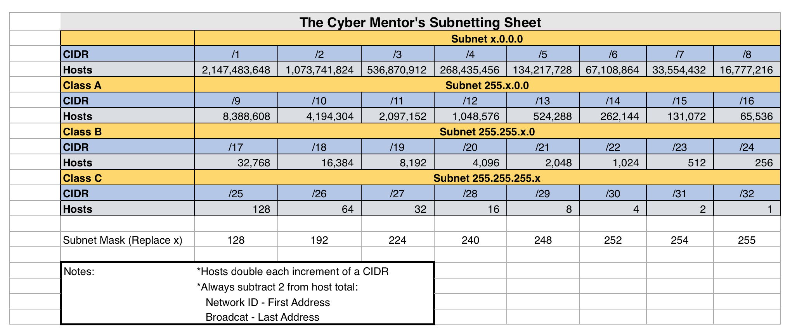

# Networking Refresher

The purpose of this page is to review fundamental networking concepts that are relevant for hackers.

## IP Addresses (OSI Layer 3)

An IPv4 address consists of 4 octets each with 8 bits (4 bytes total, 32 bits total) and is used to identify a network device.

```bash
# IPv4 Example
192.168.57.139
```

### Thinking about octets
We can think about each of the octets in terms of their 8 bits in the columns of the chart below. The value will be the sum of the numbers where there are 1.

| 2<sup>8</sup> | 2<sup>7</sup> | 2<sup>6</sup> | 2<sup>5</sup> | 2<sup>4</sup> | 2<sup>3</sup> | 2<sup>2</sup> | 2<sup>1</sup> | |
| -- | -- | -- | -- | -- | -- | -- | -- | -- |
| 128 | 64 | 32 | 16 | 8 | 4 | 2 | 1 |  |
| 1 | 1 | 1 | 1 | 1 | 1 | 1 | 1 | = 255 |
| 0 | 0 | 0 | 0 | 0 | 1 | 1 | 1 | = 7 |

In Kali we use the following commands to show ip address information.

```bash
# Show ip addresses
ip addr show
ip a

# Show ip addresses and stats in color
ip -stats -color a
ip -s -c a
```
*Note: `ifconfig` is old news now use `ip addr show`*



### IPv6 vs. IPv4

Using IPv4 we can support 2<sup>32</sup> (about 4 billion) addresses however we needed more so created IPv6. With IPv6 we can support 2<sup>128</sup> addresses. But it turns out we don't really need it because we use **NAT** (Network Address Translation) which assigns private addresses that then get routed through a single public IP address. 

So, if you have 20 devices on a network you are really only using 1 public ip address that they route through and they all get private IP addresses in the internal network.




## MAC Addresses (OSI Layer 2)

Mac addresses are the hardware addresses and the first three pairs of two (`00:1c:42` from the image above) identify the manufacturer.

Google search for "mac address manufacturer lookup" and you will find many websites that will tell you the manufacturers based on the mac you provide.



## TCP and UDP (OSI Layer 4)

TCP (Transmission Control Protocol) is **connection-oriented**. It uses the 3-way handshake to establish connections.

UDP (User Datagram Protocol) is **connection-less** and typically used for streaming like VOIP, etc.

### 3-Way Handshake - `SYN > SYN ACK > ACK`



We can use wireshark to see the `SYN > SYN ACK > ACK`


## Common Ports and Protocols

If you are hacking anything...anytime...you need to know these. If you practice a lot you will inevitably commit them to memory regardless.



## OSI Model

### Layer 1 - Physical (data cables like cat6)

### Layer 2 - Data (switching, mac addresses)

### Layer 3 - Network (routing, IP addresses)

### Layer 4 - Transport (TCP, UDP)

### Layer 5 - Session (session management)

### Layer 6 - Presentation (media like WMV, JPG, MOV)

### Layer 7 - Application (HTTP, SMTP)

*Note: A good pneumonic to remember the layers is **P**lease **D**o **N**ot **T**hrow **S**aussage **P**izza **A**way*

## Subnetting

Inside a network we have a certain number of IP addresses we can assign. The netmask (also called subnetmask) tells us this.

When you see 255 those are locked down. When you see 0, those are available.

```bash
# Example netmask for \24 network (CIDR notation)
255.255.255.0 
```

```bash
# Example netmask for \16 network (CIDR notation)
255.255.0.0
```

*Note: We typically say "wak 24" or "slash 24"*


