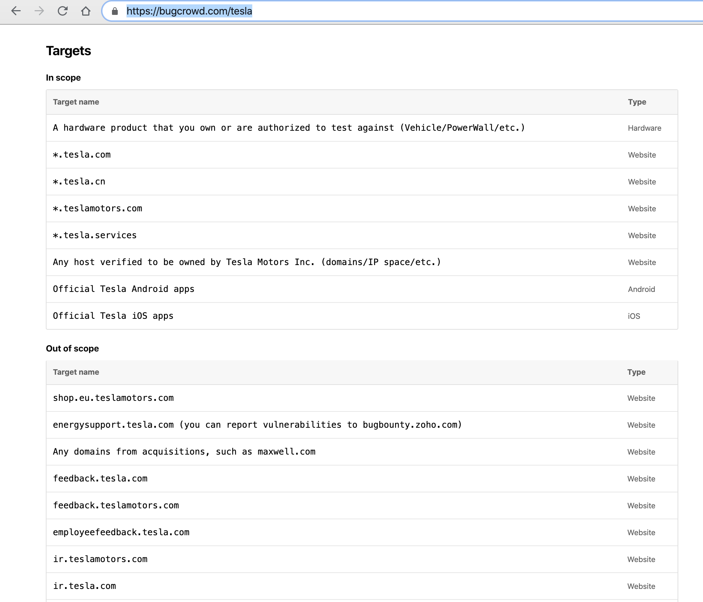
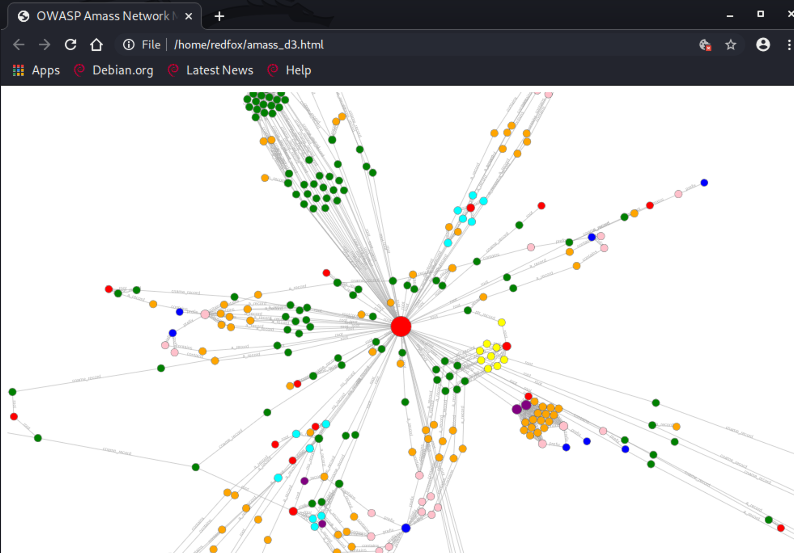
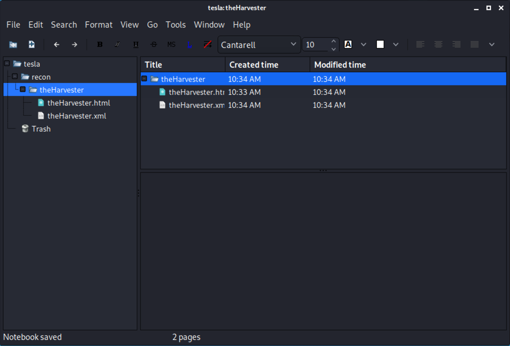
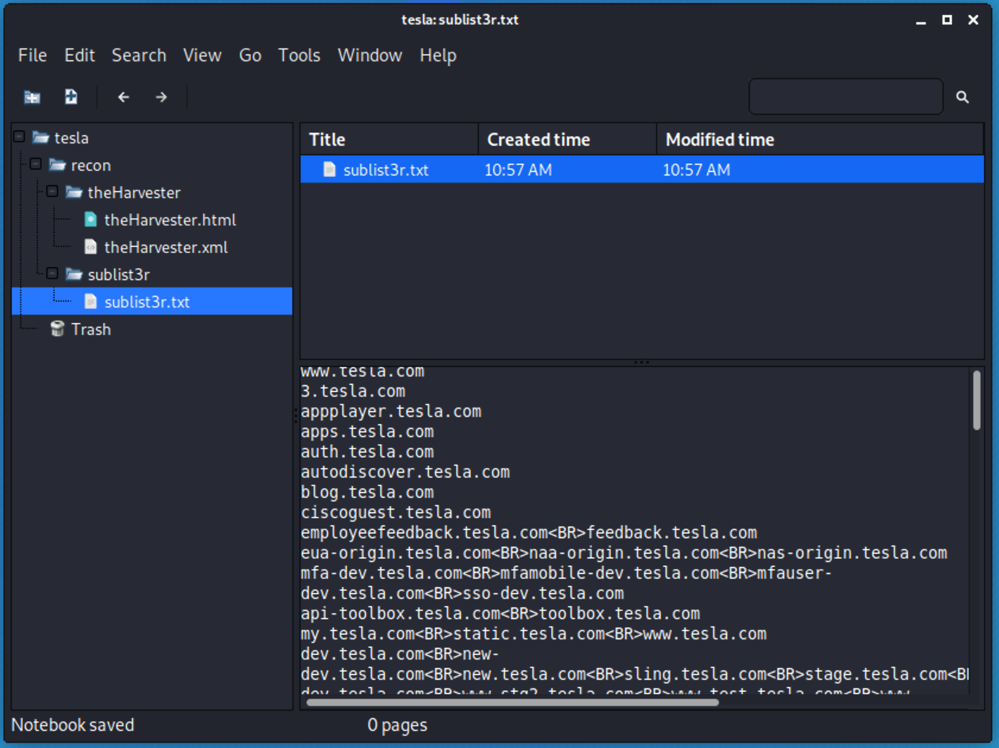
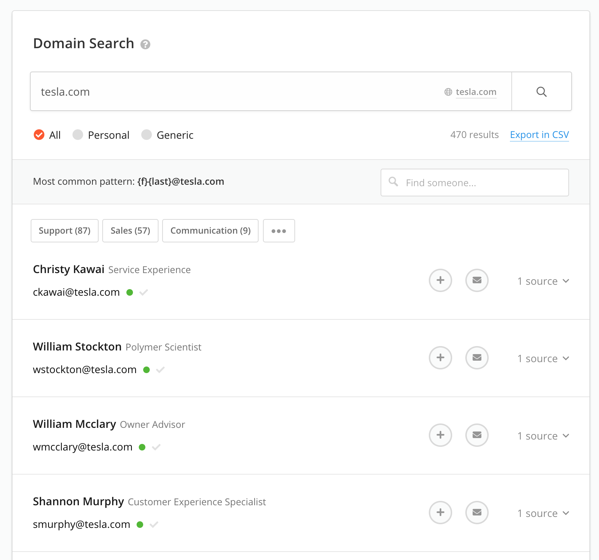
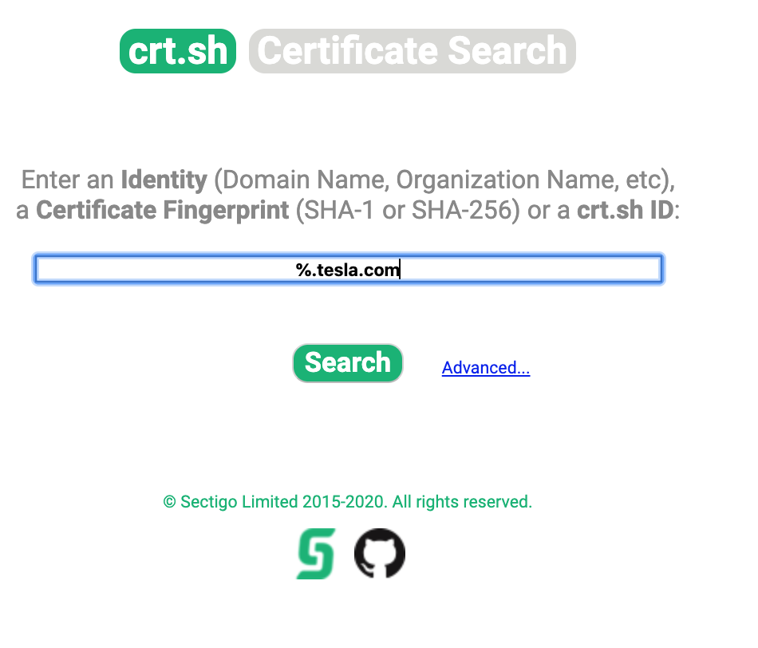

# Reconnaissance - Information Gathering

The examples below will specifically use targets listed on [bugcrowd.com](https://bugcrowd.com/programs).

*Important! Make sure you have permission to do whatever you are about to do before you do it. Read about your **target scope** and stick to that scope!*



---

# Get Started

Start by looking for the weakest links in the target's security system (usually people) try and get some initial information about who works where, what the company email patterns are, checkout leaked breached credentials, etc.

## Setup Note-taking System
We will be getting lots of information and need to have a clear notetaking, system in place.

* Download and install [KeepNote](http://keepnote.org/) if you haven't already. Its a great cross-platform notekeeping app. It doesn't come with the latest Kali so you have to `sudo apt-get install keepnote`

I like to launch Kali and keep my results (exports from tools) in a folder (eg. `tesla_exports`) then add them to a private git repo which I can access from any machine.

## [OWASP Amass](https://github.com/OWASP/Amass)
Attack surface mapping and asset discovery

In the recon stage we will use the intel module and enum module

**Intel Subcommand**

```bash
# Find organizations with tesla in their name
amass intel -org tesla
```

```bash
# Show data sources
amass intel -list
```

Most common useage for intel module is something like this where we gather intel and write to file based on a domain.

```bash
# Collect intel on domain (-d)
# show intel source (-src)
# use reverse whois (-whois)
# write results to output file (-o)
amass intel -src -whois -d tesla.com -o out.txt
```

Other noteworthy flags include 

The `-asn` flag which you get from `-org` output. You can use this instead of `-d` which looks for subdomains. 

The `-brute` flag bruteforces additional subdomains. 

The `-src` lets you see the techniques used to get results*

**Enum Subcommand**

```bash
# Passive enumeration
amass enum -passive -d tesla.com -o outfile.txt
```

```bash
# Active enumeration
amass enum -src -ipv4 -d tesla.com -o outfile.txt
```

**Viz Subcommand**

```bash
# Get d3js visualization of results
amass viz -d3
firefox amass_d3.html
```

Alternatively you can give it a specific list of domains that you want to visualize

```bash
amass viz -d3 domains.txt
```

**DB Subcommand**

```bash
# Get numbers of db lists
amass db -list

# Show specific results
amass db -enum 1 -show
```




## Identify Website Technologies

### [Builtwith](https://builtwith.com)

### [Wappalyzer Firefox Extension](https://www.wappalyzer.com/)

### [WhatWeb](https://tools.kali.org/web-applications/whatweb)

---

## Additional things that may be interesting to check out...worth a mention.

### [The Harvester](https://tools.kali.org/information-gathering/theharvester)
Gather emails, subdomains, hosts, employee names, open ports and banners from different public sources like search engines, PGP key servers and SHODAN computer database.

*Note: Some require API keys.*

```bash
# Get command syntax
$ theHarvester
$ theHarvester --help

# Run against target
$ theHarvester -d tesla.com -b google -f keep-notes/tesla/recon/theHarvester.html
```

You can also just output the results to Desktop, review them, then if you find anything interesting add it to your keep notes.


### [Sublist3r](https://github.com/aboul3la/Sublist3r)
Fast subdomain enumeration.

*Note: Amass uses sublist3r api*

```bash
$ sudo apt-install sublist3r

$ sublist3r -d tesla.com -o sublist3r.txt
```
Inspect the results and save them to your notes folder.



### [Hunter.io](https://www.hunter.io)
Primarily good at showing emails, helping you identify workplace patterns (policies). Can't export csv on free plan.



### [Breach-Parse](https://github.com/hmaverickadams/breach-parse)

Looks for breached credentials that may be of interest to you (from darkweb, etc). 

*! WARNING: Make sure you have enough space to download the data....its like 44GB!*

```bash
# Download from GitHub; put in /opt/
# Run the script with the domain of interest
# and the output file
./breach-parse.sh @tesla.com tesla.txt
```

### [crt.sh](crt.sh)
Uses certificate fingerprinting to find subdomains.



### [Tomnomnom HTTP Probe](https://github.com/tomnomnom/httprobe)
Go through a list of domains and see what is active.

This is can be a useful step given all of the domains we just found.