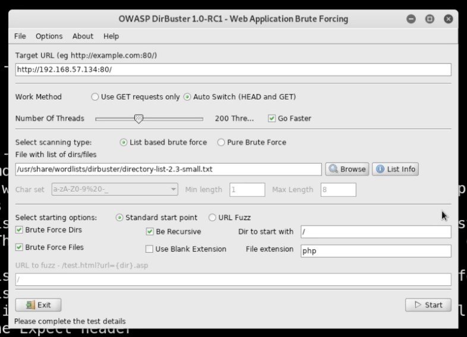

# Scanning and Enumeration

The examples below will use Kioptrix L1 VM from [vulnhub](https://www.vulnhub.com)

*Important! Make sure you have permission to do whatever you are about to do before you do it. Using VM's from vulnhub is a great idea because they are made to be hacked!*

# Scanning
We will be looking for open ports and services.

Of particular interest are **ports 80,443 (HTTP/HTTPS) and 139,445 (SMB)**.

*Note: Port 22 (ssh) is usually something you can look at and may be able to brute force but its not usually a "low hanging fruit".*

## Get the IP address of the target machine

In my case I get the Kioptrix VM ip address using arp to discover all the machines on the network

```bash
netdiscover -r 192.168.57.0/24
```

## Scan for open ports and services - `nmap`

Scan the target ip address of interest

```bash
nmap -T4 -p- -A 192.168.57.134
```

* `T4` is a good speed (T5 is fastest, T1 slowest)
* `-p-` all 65k ports (without this it scans the top 1000 ports)
* `-A` everything (versions, fingerprinting, etc)

We can also scan UDP like below. Because UDP usually takes forever to scan, we just scan the top 1000 ports.

```bash
nmap -sU -T4 -p 192.168.57.134
```

*Note: Stealth scan is denoted -sS but now its on by default so you don't have to specify. Also beware that stealth scanning is still detectable if there is good security. The stealth mode works by doing `SYN SYNACK RST` and since we are never making connections its considered "stealthy".*

# Enumerating

## IF PORT 80 or 443 is OPEN (HTTP/HTTPS)

### Fire up Nikto
A web vulnerability scanner; also does a little bit of directory busting for us.

```bash
nikto -h https://192.168.57.134
```

*Note: You might find that nikto scans are being blocked if they have good security :) Look up ways around this.*

### Fire up `dirbuster&`



### Fire up Burpsuite
Replay and look for information disclosure.

Burpsuite is very frequently useful to checkout what is being sent back and forth as well as if you have login pages consider using replay attacks.

## IF PORT 139 or 445 is OPEN (SMB)
SMB is a file share system commonly used internally by companies. Its known for being *very insecure*.

### Fire up metasploit
Auxillary modules are for enumeration. Checkout usage example below.

```bash
msfconsole

msf5 > search smb

msf5 > use 60

msf5 > use auxillary/scanner/smb/smb_version

msf5 auxillary(scanner/smb/smb_version) > info

msf5 auxillary(scanner/smb/smb_version) > options

msf5 auxillary(scanner/smb/smb_version) > set RHOSTS 192.168.57.134

msf5 auxillary(scanner/smb/smb_version) > run
```

### Fire up `smbclient`
Attempt to connect to the file share system

```bash
smbclient -L \\\\192.168.3.2\\
```

## IF PORT 22 is OPEN (ssh)
Attempt to make an ssh connection

```bash
 # Check for a banner..sometimes interesting
ssh 192.168.3.2
```

# Additional scanning tools that may be worth checking out

## Masscan

```bash
masscan -p --rate 1000 1-56535 192.168.x.y
```

## Nessus
*Sign up; Download/install; Free version lets you scan any internal IP address; not external*

```bash
nessus
```
