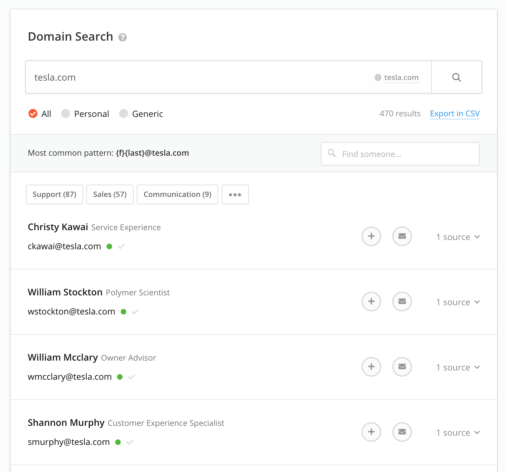

# Reconnaissance - Information Gathering

In these examples we will specifically use targets listed on [bugcrowd.com](https://bugcrowd.com/programs).

*Important! Make sure you have permission to do whatever you are about to do before you do it. Read about your **target scope** and stick to it!*


## Email Gathering - Hunter.io

Look for who you may want to target try and get some initial information about who works where, what the company email patterns are, etc.



### [Breach-Parse](https://github.com/hmaverickadams/breach-parse)

Looks for breached credentials that may be of interest to you (from darkweb, etc). In our case, looking at tesla domain we can run the script like this.

```bash
./breach-parse.sh @tesla.com tesla.txt
```

### [The Harvester](https://tools.kali.org/information-gathering/theharvester)
*Note: Some require API keys.*

```bash
theharvester -d tesla.com -l 500 -b google
```

## Finding Subdomains

### `sublist3r`

```bash
apt-install sublist3r

sublist3r -d tesla.com
```

### [crt.sh](crt.sh)
Uses certificate fingerprinting to find subdomains.


### `tomnomnom` http probe
Go through a list of domains and see what is active
https://github.com/tomnomnom/httprobe

### OWASP Amass

https://github.com/OWASP/Amass

Amass does a lot of what we did

## Identifying Website Technologies

### builtwith
https://builtwith.com/tesla.com

### wappalyzer extension firefox
https://www.wappalyzer.com/

### whatweb

```bash
whatweb https://tesla.com
```